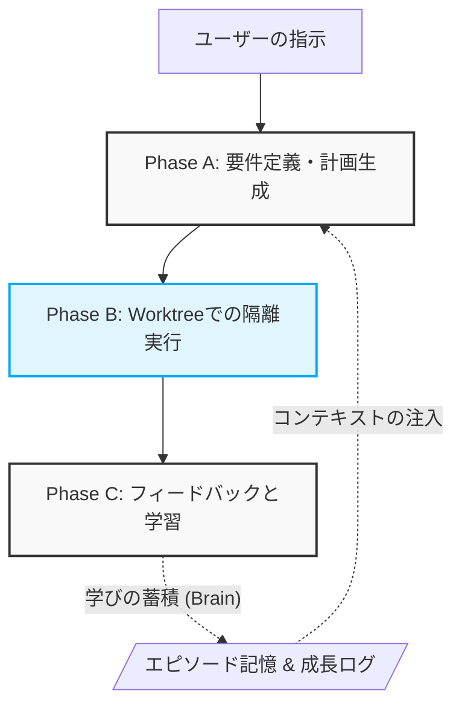

# Deba

**あなたのコードで育ち、裏側で働く「専属の新人エンジニア」**

Deba（Developer's Evolving Brain Agent）は、既存のGitリポジトリに寄り添い、あなたと共に成長する自律型AIエージェントCLIです。

一般的なAIコーディングツールがあなたのエディタに介入するのに対し、Debaは**「Git Worktree」を用いた隔離環境**であなたと並行してタスクをこなします。さらに、タスクを重ねるごとにプロジェクト固有の規約やあなたのフィードバックを学習し、ユーザーの介入なしに高品質な成果物を生み出せるように「成長」していきます。

## ✨ コア・エクスペリエンス

* **裏側で働く（Git-Native Isolation）**
あなたの現在の作業ブランチを一切汚しません。裏側で自動的に Worktree を作成し、そこでコードの変更やテストを実行します。
* **あなたのコードで育つ（Contextual Evolution）**
一般的な知識ではなく「あなたのプロジェクトの文脈」を学習します。エピソード記憶（成功/失敗体験）から意味記憶（プロジェクト規約）へと知識を昇華させ、同じミスを繰り返しません。
* **完全なポータビリティ（Clean Repository）**
学習した知識（Brain）はリポジトリ内ではなく、グローバル環境（`~/.deba/`）にプロジェクトごとに集約されます。メインのリポジトリをクリーンに保ちつつ、コンテキストを永続化します。

## 🔄 ワークフローと成長サイクル

Debaは「計画 → 実行 → 振り返り」の3フェーズを一気通貫で行います。



1. **Phase A (Plan)**: ユーザーの要望と過去の記憶から、実装計画と注意事項（YAML）を一括生成。
2. **Phase B (Execute)**: 計画に基づき、Worktree内で自律的にコードを生成・変更。
3. **Phase C (Review)**: ユーザーのフィードバックを受け取り、学びを抽出して次回以降のタスクに活かす。

---

## 🚀 セットアップ

### 前提条件

* Node.js
* [Gemini CLI](https://github.com/google-gemini/gemini-cli) がインストール済みであること

### インストール

```bash
git clone https://github.com/nqounet/deba.git
cd deba
npm install
npm run build

# エージェント用スキル定義の初期化
npm run deba -- maintenance setup-skill

```

## 💻 使い方

基本的には、`npm run deba -- <command>` の形式で実行します。

### 主要コマンド一覧

| コマンド | 説明 |
| --- | --- |
| `deba run <request>` | **【推奨】** 計画作成 → 検証 → 実装 の一気通貫実行 |
| `deba review <task_id>` | **【重要】** タスク完了後のフィードバックと学習の実行 |
| `deba plan <request>` | Phase A: 要件定義と実装計画のみを生成 |
| `deba execute --step <id> --plan <file>` | Phase B: 計画に基づく単一ステップの実行 |
| `deba validate <file>` | 計画ファイル（YAML）のスキーマ / 依存グラフ検証 |
| `deba skills` | 現在エージェントが獲得しているスキル（規約）の一覧表示 |
| `deba skills-promote <rule>` | 学びを正式なスキル（意味記憶）に昇格させる |
| `deba chat <message>` | シンプルな LLM チャット |

### 実行例

```bash
# 1. タスクの依頼（裏側でWorktreeが作られ、作業が進行します）
npm run deba -- run "ヘッダーコンポーネントをナビゲーションとロゴに分割して"

# 2. 作業完了後、結果に対するフィードバックを与えてエージェントを成長させます
npm run deba -- review task_20260223_001

```

## 📁 アーキテクチャとディレクトリ構成

Debaは、外部SDKに依存せず `gemini` CLI を直接呼び出すシンプルかつ堅牢な設計を採用しています。さらに、すべてのLLM入出力をスナップショットとして保存し、完全な透明性と再現性を担保しています。

```text
deba/
├── src/                  # TypeScript ソースコード
│   ├── cli.ts            # CLI エントリーポイント
│   ├── commands/         # CLI コマンド実装 (plan, run, review等)
│   ├── prompt.ts         # 動的プロンプト構築 (Phase A/B/C)
│   ├── episode.ts        # エピソード記憶管理
│   ├── growthLog.ts      # 成長ログ管理
│   └── skills.ts         # 意味記憶（スキル）管理
├── docs/                 # 設計・計画ドキュメント群
├── brain/                # ローカル学習データ（.gitignore対象）
└── snapshots/            # LLM 入出力履歴（.gitignore対象）

```

> **Note**: 詳細な設計思想（Worktree連携、3層記憶モデル、LLM利用計画など）については、`docs/design/` および `docs/plans/` を参照してください。

## 🛠 技術スタック

* **言語**: TypeScript (ESNext, NodeNext modules)
* **ビルド**: `tsc`
* **LLM**: `gemini` CLI（`child_process.execFile` 経由で呼び出し）
* **依存ライブラリ**: `commander`（CLIルーティング）, `yaml`（YAMLパース）

## 📄 ライセンス

[MIT](LICENSE)
