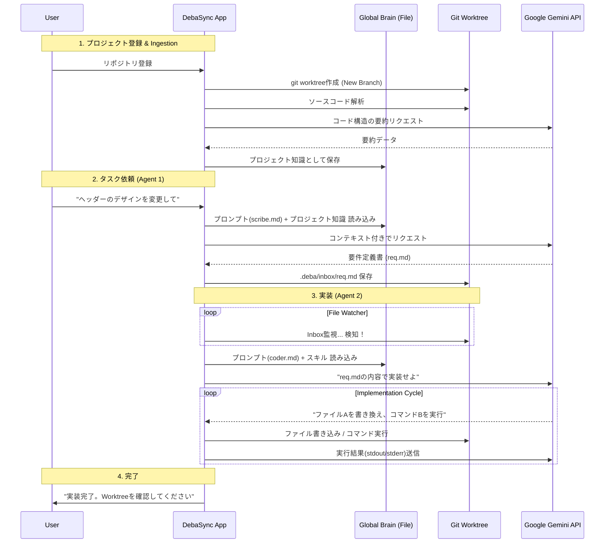

非常に洗練された、実践的な開発ワークフローですね。`git worktree` を利用することで、メインの作業環境を汚さずにエージェントが裏で作業を行い、かつ「プロジェクトの取り込み（Ingestion）」をブランチ作成時に行うというフローは、CI/CDパイプラインとローカル開発の良さを組み合わせた強力なアーキテクチャです。

この要件（Markdownプロンプト管理、Git Worktree運用、Brainへの取り込み）を統合した「**DebaSync v3**」のシステム設計を提示します。

---

# システムアーキテクチャ: Deba - Portable Agent & Worktree Integration

## 1. システム全体像

Deba は、既存の Git リポジトリ内に「エージェント専用の作業領域（Worktree）」を自動構築し、そこで自律的に作業を行う「成長する新人エンジニア」型 AI エージェント CLI です。
グローバル設定に依存せず、プロジェクトルート内に知識（Brain）と作業領域（Worktrees）を保持する「ポータブル・エージェント」の思想に基づいています。

## 2. ディレクトリ構造とデータ管理

プロジェクトルート直下に以下のディレクトリを自動生成し、状態を管理します。

### 2.1 Project Brain (`brain/`)

エージェントの知識、経験、獲得したスキルが集約される場所です。

```text
brain/
├── episodes/                 # タスクごとの実行記録（成功・失敗のコンテキスト）
├── skills/                   # 承認済みのスキル（コーディング規約・ベストプラクティス）
│   ├── proposals/            # 承認待ちのスキル提案
│   └── *_conventions.md      # プロジェクト別・言語別の規約ドキュメント
├── growth_log/               # 日々の学びの集約ログ
└── queue/                    # 非同期実行用のタスクキュー（将来拡張）
```

### 2.2 Managed Worktrees (`.worktrees/`)

エージェントが隔離環境で作業するためのディレクトリ群です。`.gitignore` により Git 管理からは除外されます。

```text
.worktrees/
└── deba-wt-{task_id}/        # git worktree で一時的に作成される作業実体
    ├── .git                  # メインリポジトリを指す .git ファイル
    └── (Source Code)         # 特定のブランチがチェックアウトされたコード
```

### 2.3 Snapshots (`snapshots/`)

LLM とのやり取り（プロンプト全文、生レスポンス、パース結果、メタ情報）の全ての履歴です。再現性の確保と品質分析に利用します。

## 3. ワークフロー: Git Worktree 隔離

### A. 隔離実行フロー

1. **Worktree作成**:
   - `git worktree add -b feature/{task_id} .worktrees/deba-wt-{task_id}` を実行。
   - メインの作業ディレクトリ（ユーザーが VSCode 等で開いている場所）を一切汚さず、独立した場所でエージェントが試行錯誤を行います。

2. **自律作業**:
   - エージェントは `.worktrees/` 内のコードを修正し、テストを実行し、自己修正を繰り返します。

3. **マージ & クリーンアップ**:
   - 作業完了後、メインリポジトリ側で `git merge --squash` を行い、変更を取り込みます。
   - `git worktree remove` により作業ディレクトリを完全に消去します。

### B. 自己成長サイクル

1. **Episode 記録**: タスク完了時に「何をしたか」「何が問題だったか」を `brain/episodes/` に保存。
2. **Review & Learning**: ユーザーによる `deba review` を通じて「学び」を抽出し、`growth_log` に記録。
3. **Consolidation**: `maintenance consolidate-skills` コマンドにより、蓄積された学びを整理・統合し、`brain/skills/` の規約をアップデート（リファクタリング）します。

## 3. プロンプト管理（Markdownテンプレート）

プロンプトはMarkdownファイルとして保存し、実行時に動的に変数を埋め込みます。

**例: `~/.deba/prompts/agent1_scribe.md**`

```markdown
# Role
あなたは熟練のPMです。

# Context
現在、以下のプロジェクトで作業しています。
プロジェクト概要: {{PROJECT_SUMMARY_FROM_BRAIN}}

# User Request
{{USER_MESSAGE}}

# Instructions
ユーザーの要望を分析し、開発エージェントが実装可能な形式（Markdown）で出力してください。
以下のセクションを含めること:
1. **Goal**: 目的
2. **Specs**: 技術的仕様
3. **Acceptance Criteria**: 完了条件

# Output Format
Markdownのみを出力してください。

```

アプリは実行時に `{{USER_MESSAGE}}` などを置換してGemini APIに送信します。

## 4. プロジェクト登録とGit Worktreeフロー

### A. プロジェクト登録フロー（Ingestion）

ユーザーが既存のGitリポジトリをDebaSyncに登録する際の処理です。

1. **Worktree作成**:
* アプリは `git worktree add -b feature/ai-agent-{timestamp} ~/.deba/worktrees/{name} {base_branch}` を実行。
* メインリポジトリを汚さず、完全に独立したディレクトリを作成。


2. **Brainへの取り込み (Ingestion)**:
* Worktree内の全ファイル（`.gitignore`対象外）をスキャン。
* Gemini APIを使い、プロジェクトの構造、使用技術、主要なファイルの役割を要約。
* 結果を `~/.deba/brain/projects/{repo_hash}.json` に保存。これが「エージェントの事前知識」となります。


### B. プロジェクト削除フロー

1. **Worktree削除**:
* アプリは `git worktree remove ~/.deba/worktrees/{name} --force` を実行。
* これにより、作業用ディレクトリは消えますが、Gitのブランチ（`feature/ai-agent-...`）とコミット履歴はメインリポジトリに残ります（いつでもマージ可能）。


2. **Brainデータの扱い**:
* プロジェクト固有のインデックスは「アーカイブ」として残すか、ユーザー選択で削除します（次回同じリポジトリを開く時の高速化のため残すのが推奨）。


## 5. エージェント連携フロー (Mermaid Diagram)



## 6. 技術的なキーポイント

### 1. `git worktree` の利点活用

* **並行作業**: ユーザーがメインリポジトリでVSCodeを開いて作業していても、エージェントは別のディレクトリ（Worktree）で作業するため、ファイルの競合やロックが発生しません。
* **レビューの容易さ**: エージェントの作業は全て新規ブランチ上のコミットになるため、ユーザーはメインリポジトリから `git diff main feature/ai-agent-...` で変更内容を安全に確認・マージできます。

### 2. Brainへの「取り込み」の工夫

Gemini 1.5/2.0 はコンテキストウィンドウが広いため、小〜中規模プロジェクトであれば、**全ソースコードを連結してプロンプトのコンテキストに含める**ことが最も精度が高いです。

* **Small Repo**: 全ファイルをそのままコンテキストに入れる。
* **Large Repo**: 上記の「Ingestion」プロセスで作成した「要約json」と、関連しそうなファイルのみをRAG（検索）でピックアップしてコンテキストに入れる。

### 3. Markdownプロンプトの更新（自己成長）

エージェントがタスク完了後に「振り返り」を行い、有用な知見を得た場合、`~/.deba_config/brain/skills/` にMarkdownファイルを追加するだけでなく、**プロンプト自体を改善する提案**をユーザーに行う機能も考えられます。
（例: 「私の計画プロンプト（planner.md）に『テストコードを先に書く』という指示を追加すべきです」と提案する）

---

この構成により、エージェントは「ユーザーの横で、別のデスク（Worktree）で作業し、会社のドキュメント（Brain）を参照しながら成長する新人エンジニア」のような存在になります。
