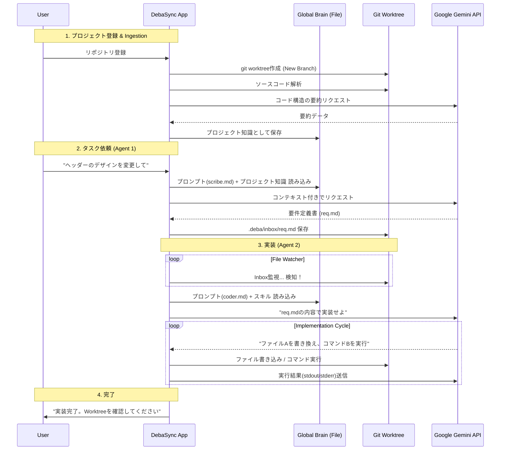

非常に洗練された、実践的な開発ワークフローですね。`git worktree` を利用することで、メインの作業環境を汚さずにエージェントが裏で作業を行い、かつ「プロジェクトの取り込み（Ingestion）」をブランチ作成時に行うというフローは、CI/CDパイプラインとローカル開発の良さを組み合わせた強力なアーキテクチャです。

この要件（Markdownプロンプト管理、Git Worktree運用、Brainへの取り込み）を統合した「**DebaSync v3**」のシステム設計を提示します。

---

# システム構想書: DebaSync v3 - Worktree & Brain Integration

## 1. システム全体像

このシステムは、ユーザーの既存リポジトリから「エージェント専用の作業場（Worktree）」を切り出し、そこでエージェントが自律的に作業を行います。エージェントの思考回路（プロンプト）は外部Markdownファイルとして管理され、ユーザーが容易に調整・改善可能です。

## 2. ディレクトリ構造とデータ管理

システムは、**Global Brain（脳・設定）** と **Workspaces（作業場）** の2つの領域を管理します。

### 2.1 Global Brain (`~/.deba_config/`)

エージェントの知識、設定、プロンプトが集約される場所です。

```text
~/.deba/
├── prompts/                  # プロンプトテンプレート（Markdown）
│   ├── agent1_scribe.md      # 要件定義用プロンプト
│   ├── agent2_planner.md     # 計画立案用プロンプト
│   ├── agent2_coder.md       # 実装用プロンプト
│   └── reflection.md         # 振り返り・学習用プロンプト
├── brain/                    # 獲得したスキルとプロジェクト知識
│   ├── skills/               # 汎用スキル（言語別・フレームワーク別）
│   └── projects/             # プロジェクトごとのインデックス（Ingestion結果）
│       └── {repo_hash}.json  # リポジトリ構造、主要クラス、依存関係の要約
└── settings.json             # APIキーやGit設定

```

### 2.2 Managed Worktrees (`~/.deba/worktrees/`)

アプリが管理するエージェント用の作業ディレクトリです。

```text
~/.deba/worktrees/
└── {project_name}_{timestamp}/  # git worktreeで作成された実体
    ├── .git                     # (.git file pointing to main repo)
    ├── .deba/                   # エージェント間通信用
    │   ├── inbox/               # Agent 1の出力先
    │   └── ...
    └── (Source Code)            # チェックアウトされたコード

```

## 3. プロンプト管理（Markdownテンプレート）

プロンプトはMarkdownファイルとして保存し、実行時に動的に変数を埋め込みます。

**例: `~/.deba/prompts/agent1_scribe.md**`

```markdown
# Role
あなたは熟練のPMです。

# Context
現在、以下のプロジェクトで作業しています。
プロジェクト概要: {{PROJECT_SUMMARY_FROM_BRAIN}}

# User Request
{{USER_MESSAGE}}

# Instructions
ユーザーの要望を分析し、開発エージェントが実装可能な形式（Markdown）で出力してください。
以下のセクションを含めること:
1. **Goal**: 目的
2. **Specs**: 技術的仕様
3. **Acceptance Criteria**: 完了条件

# Output Format
Markdownのみを出力してください。

```

アプリは実行時に `{{USER_MESSAGE}}` などを置換してGemini APIに送信します。

## 4. プロジェクト登録とGit Worktreeフロー

### A. プロジェクト登録フロー（Ingestion）

ユーザーが既存のGitリポジトリをDebaSyncに登録する際の処理です。

1. **Worktree作成**:
* アプリは `git worktree add -b feature/ai-agent-{timestamp} ~/.deba/worktrees/{name} {base_branch}` を実行。
* メインリポジトリを汚さず、完全に独立したディレクトリを作成。


2. **Brainへの取り込み (Ingestion)**:
* Worktree内の全ファイル（`.gitignore`対象外）をスキャン。
* Gemini APIを使い、プロジェクトの構造、使用技術、主要なファイルの役割を要約。
* 結果を `~/.deba/brain/projects/{repo_hash}.json` に保存。これが「エージェントの事前知識」となります。


### B. プロジェクト削除フロー

1. **Worktree削除**:
* アプリは `git worktree remove ~/.deba/worktrees/{name} --force` を実行。
* これにより、作業用ディレクトリは消えますが、Gitのブランチ（`feature/ai-agent-...`）とコミット履歴はメインリポジトリに残ります（いつでもマージ可能）。


2. **Brainデータの扱い**:
* プロジェクト固有のインデックスは「アーカイブ」として残すか、ユーザー選択で削除します（次回同じリポジトリを開く時の高速化のため残すのが推奨）。


## 5. エージェント連携フロー (Mermaid Diagram)



## 6. 技術的なキーポイント

### 1. `git worktree` の利点活用

* **並行作業**: ユーザーがメインリポジトリでVSCodeを開いて作業していても、エージェントは別のディレクトリ（Worktree）で作業するため、ファイルの競合やロックが発生しません。
* **レビューの容易さ**: エージェントの作業は全て新規ブランチ上のコミットになるため、ユーザーはメインリポジトリから `git diff main feature/ai-agent-...` で変更内容を安全に確認・マージできます。

### 2. Brainへの「取り込み」の工夫

Gemini 1.5/2.0 はコンテキストウィンドウが広いため、小〜中規模プロジェクトであれば、**全ソースコードを連結してプロンプトのコンテキストに含める**ことが最も精度が高いです。

* **Small Repo**: 全ファイルをそのままコンテキストに入れる。
* **Large Repo**: 上記の「Ingestion」プロセスで作成した「要約json」と、関連しそうなファイルのみをRAG（検索）でピックアップしてコンテキストに入れる。

### 3. Markdownプロンプトの更新（自己成長）

エージェントがタスク完了後に「振り返り」を行い、有用な知見を得た場合、`~/.deba_config/brain/skills/` にMarkdownファイルを追加するだけでなく、**プロンプト自体を改善する提案**をユーザーに行う機能も考えられます。
（例: 「私の計画プロンプト（planner.md）に『テストコードを先に書く』という指示を追加すべきです」と提案する）

---

この構成により、エージェントは「ユーザーの横で、別のデスク（Worktree）で作業し、会社のドキュメント（Brain）を参照しながら成長する新人エンジニア」のような存在になります。
