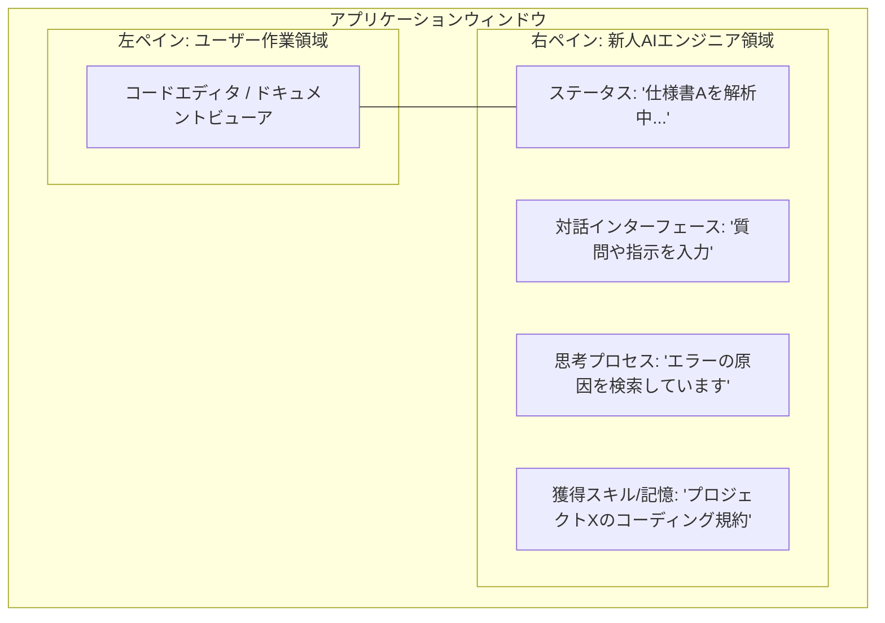

「ユーザーの隣の席で、会社のドキュメントを読み込みながら成長する新人エンジニア」というGUIアプリのコンセプトは、単なるタスク自動化ツールを超えた、非常に優れたUXデザインです。

この「成長」を中心に据えたシステムを実現するためのアーキテクチャとUI構成を提案します。

### 1. 「成長」を定義する3つのメカニズム

AIにおける「成長」を、システム的に以下の3段階で実装します。

1. **知識の吸収（RAGの動的更新）**: 指定された社内ドキュメント（PDF、Markdown、ソースコード）を読み込み、ベクトルデータベース（Vector DB）に記憶させます。
2. **業務ルールの獲得（Memory/Reflection）**: ユーザーからの「訂正」や「フィードバック」を一時的な会話履歴として終わらせず、AIが自己反省（Reflection）を行い、「永続的なルール」として記憶（Memory）に昇格させます。
3. **プロアクティブな提案（自律性の向上）**: 初期設定では「指示待ち」ですが、成長するにつれて「過去に似たエラーを見たので、このドキュメントを調べましょうか？」と自律的に提案するモードへ移行させます。

### 2. GUIレイアウト構想（Mermaid）

クロスプラットフォームなデスクトップアプリとしてElectronを採用し、バックエンドのLLM（Gemini等）と連携する構成を想定したUIレイアウトです。隣の席の「気配」を感じさせるため、画面を分割してAIの作業状態を常に可視化します。

### 3. 推奨される技術スタック

* **フロントエンド**: Electron + React/Vue (デスクトップへの常駐と、ローカルファイルシステムへのアクセスに優れるため)
* **バックエンドLLM**: Gemini (広大なコンテキストウィンドウを持ち、大量の社内ドキュメントの一括読み込みと推論に最適)
* **記憶領域 (Vector DB)**: ChromaDB または SQLite + VSS (ローカルで完結させ、機密情報を外部に漏らさない構成)

---

### 結論と確信度・不確実性

**結論:** RAG（検索拡張生成）と動的プロンプト生成を組み合わせることで、「成長する新人エンジニア」というコンセプトのGUIアプリは十分に実現可能です。

* **確信度 (高):** 現在のLLM（特にGeminiのような長大コンテキスト対応モデル）とVector DBをElectronでラップするアーキテクチャは技術的に確立されており、開発の障壁は低いです。
* **不確実な要素 (中):** 1.  **記憶のコンフリクト**: AIが学習（記憶）を重ねるにつれ、「古い社内ルール」と「新しい社内ルール」が衝突した際、どちらを優先すべきかの判断（記憶の忘却と更新）の制御が難しくなる可能性があります。
2.  **ハルシネーション（幻覚）**: 社内ドキュメントの記述が曖昧な場合、AIが誤った事実を「正しい知識」として学習してしまうリスクがあります。

この不確実性を軽減するためには、AIが新しいルールを「記憶」に追加する直前に、ユーザーに「このルールを学習してもよいですか？」と承認を求めるUI（フィードバックループ）を組み込むことが有効です。

まずは、この「記憶（ルールやフィードバック）」をどのようにデータベースに保存し、AIのプロンプトに組み込むかという **「記憶と学習のデータスキーマ」**の設計から始めましょうか？ あるいは、Electronによる**フロントエンドの実装方針**について深掘りしますか？
