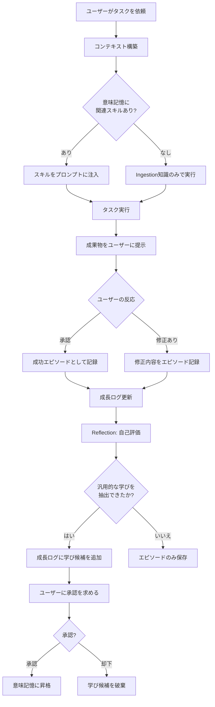
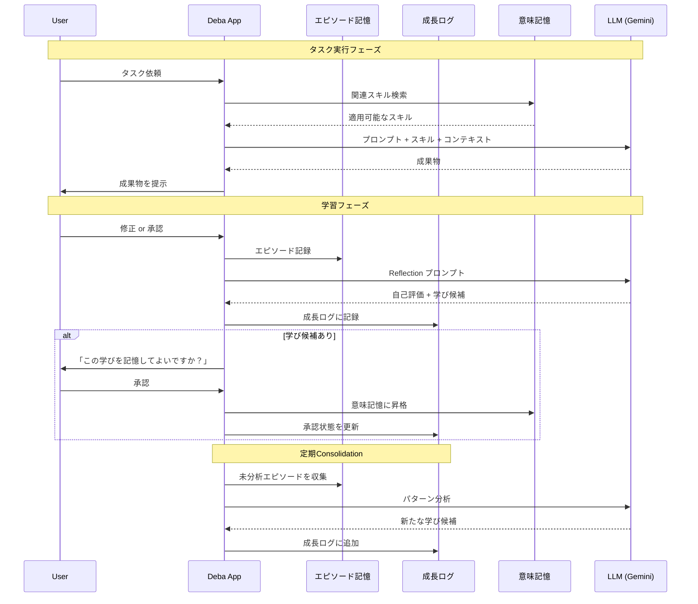

# Deba v3 システム構想書: 「成長する新人エンジニア」

## 0. ビジョン

> Debaは、AIエージェントを「ユーザーの横で、別のデスクで作業し、会社のドキュメントを参照しながら成長する新人エンジニア」として扱うGUIアプリケーションである。
> 本構想書では、特に **「成長する」** というコア体験の設計に焦点を当てる。

### 成長の定義

**成長 = ユーザーの介入量が減り、かつ成果物の品質が維持・向上すること**

これは単なる知識の蓄積ではなく、以下の3つの要素で構成される:

1. **知識の深化**: ドキュメントやコードの理解が進み、文脈に即した判断ができるようになる
2. **行動パターンの洗練**: ユーザーのフィードバックを通じて、好まれるやり方を獲得する
3. **自律性の向上**: 信頼の蓄積に応じて、より大きな裁量で判断できるようになる

---

## 1. 成長アーキテクチャ: 3層記憶モデル

AIの成長を実現する記憶システムは、認知科学の知見に基づく3層構造で設計する。

```
┌─────────────────────────────────────────────────────┐
│                意味記憶 (Semantic Memory)              │
│  抽象化されたルール・パターン・スキル                      │
│  例: 「このプロジェクトではテストを先に書く」              │
│  ※ユーザー承認済みのルールのみ格納                       │
├─────────────────────────────────────────────────────┤
│                成長ログ (Growth Log)                    │
│  「何を学んだか」「どう活用したか」「承認状態」を時系列記録  │
│  可視化のSingle Source of Truth                        │
├─────────────────────────────────────────────────────┤
│              エピソード記憶 (Episodic Memory)            │
│  個々のタスク経験の生記録                                │
│  例: タスクID, 入力, 出力, ユーザー修正内容, 自己評価     │
└─────────────────────────────────────────────────────┘
```

### 1.1 エピソード記憶 (Episodic Memory)

個々のタスク実行の完全な記録。成長の「原材料」となる。

**保存場所**: `~/.deba/brain/episodes/`

```markdown
<!-- ~/.deba/brain/episodes/2026-02-23_001.md -->
# Episode: ヘッダーコンポーネントのリファクタリング

- **日時**: 2026-02-23T14:30:00
- **プロジェクト**: web-app-frontend
- **タスク種別**: リファクタリング
- **ユーザー指示**: 「ヘッダーのコンポーネントを分割して」
- **実行内容**: Header.tsx を HeaderNav, HeaderLogo, HeaderSearch に分割
- **ユーザー修正**: HeaderSearchのprops設計を修正された（検索クエリをliftせずローカルstateで保持すべきだった）
- **自己評価**: 状態管理の粒度判断に課題あり。このプロジェクトではローカルstateを優先する方針かもしれない。
```

### 1.2 成長ログ (Growth Log)

エピソード記憶から抽出された「学び」を記録し、その活用状況を追跡する中間層。成長可視化の唯一の信頼できるデータソースとなる。

**保存場所**: `~/.deba/brain/growth_log/`

```markdown
<!-- ~/.deba/brain/growth_log/2026-02.md -->
# Growth Log: 2026年2月

## 2026-02-23

### 学び: ローカルstate優先の方針
- **由来エピソード**: episodes/2026-02-23_001.md
- **内容**: web-app-frontendプロジェクトでは、コンポーネント固有の状態はliftせずローカルstateで保持する方針
- **承認状態**: 🟡 ユーザー承認待ち
- **活用実績**: (なし)

### 学び: テストファイルの命名規則
- **由来エピソード**: episodes/2026-02-21_003.md
- **内容**: テストファイルは `*.test.ts` ではなく `*.spec.ts` を使用する
- **承認状態**: ✅ 承認済み (2026-02-22)
- **活用実績**:
  - 2026-02-23: UserProfile.spec.ts を自動生成時に適用 → ユーザー修正なし ✅
```

### 1.3 意味記憶 (Semantic Memory)

ユーザーが承認した、抽象化されたルール・パターン・スキル。プロンプトのコンテキストとして直接注入される。

**保存場所**: `~/.deba/brain/skills/` (既存設計と統合)

```markdown
<!-- ~/.deba/brain/skills/web-app-frontend_conventions.md -->
# web-app-frontend: コーディング規約

## 状態管理
- コンポーネント固有の状態はローカルstateで保持する (2026-02-23 学習)
- グローバル状態はZustandを使用する (Ingestion時に検出)

## テスト
- テストファイルは `*.spec.ts` 命名を使用する (2026-02-22 学習)
- テストはコンポーネントと同階層に配置する (Ingestion時に検出)
```

---

## 2. 成長サイクル: 学習ループの設計

### 2.1 タスク実行サイクル



### 2.2 Reflectionプロセス

タスク完了後に実行される自己評価プロセス。成長の起点となる。

```markdown
<!-- ~/.deba/prompts/reflection.md -->
# Reflection Prompt

あなたは直前のタスクを振り返る新人エンジニアです。

## 直前のタスク
{{EPISODE_SUMMARY}}

## ユーザーの修正内容
{{USER_CORRECTIONS}}

## 質問
1. ユーザーの修正から、どのような一般的なルールやパターンを学べますか？
2. この学びは、今後の別のタスクにも適用できますか？
3. 既存のスキル（下記）と矛盾する点はありますか？

## 既存スキル
{{CURRENT_SKILLS}}

## 出力形式
- **学びの要約**: （1文で）
- **汎用性**: 高い / 中程度 / このプロジェクト固有
- **既存スキルとの関係**: 新規 / 補強 / 修正（どのスキルを修正すべきか）
```

### 2.3 Consolidation（定期統合）

蓄積されたエピソード記憶を定期的に分析し、まだ言語化されていないパターンを発見する。

- **トリガー**: 同一プロジェクトで10エピソード蓄積ごと、または週次
- **処理**: 類似エピソードのクラスタリング → 共通パターンの抽出 → 学び候補の生成
- **出力**: 成長ログへの新規エントリ（ユーザー承認待ち）

---

## 3. 信頼レベルと自律性の委譲

新人エンジニアへの信頼が増すにつれ、裁量が拡大するモデル。

### 3.1 信頼レベルの定義

| レベル | 名称 | 行動範囲 | 昇格条件 |
|--------|------|----------|----------|
| 1 | **見習い** | 全ての出力をユーザーに確認してから適用 | 初期状態 |
| 2 | **一人前** | 軽微な変更（フォーマット、命名修正等）は確認なしで適用可 | 直近20タスクのユーザー修正率 < 20% |
| 3 | **信頼** | 定義済みパターンに合致するタスクは自律実行し、結果のみ報告 | 直近50タスクのユーザー修正率 < 10% かつ レベル2で30タスク以上 |

### 3.2 信頼メトリクスの計算

```
修正率 = (ユーザーが修正したタスク数) / (全タスク数) × 100

信頼スコア = Σ (タスク重み × 成功フラグ) / Σ (タスク重み)
  ※ タスク重みは複雑度に応じて 1〜3
  ※ 直近のタスクほど重みを大きくする（指数減衰）
```

### 3.3 レベルダウンの仕組み

信頼は一方向ではない。重大なミス（ユーザーが大幅に修正、またはタスクを却下）が発生した場合、信頼レベルを1段階下げる。これにより「成長だけでなく失敗からも学ぶ」というナラティブが成立する。

---

## 4. 成長の可視化 (UI設計)

### 4.1 画面構成

```
┌───────────────────────────────────────────────────────────┐
│  Deba - web-app-frontend                    [設定] [レポート] │
├────────────────────────┬──────────────────────────────────┤
│                        │  🟢 作業中: コンポーネント分割     │
│                        │                                  │
│   ユーザー作業領域       │  💬 対話エリア                    │
│   (コードエディタ /     │  ┌──────────────────────────┐    │
│    ドキュメントビューア)  │  │ 前回の経験を活かして、     │    │
│                        │  │ ローカルstateで実装します   │    │
│                        │  └──────────────────────────┘    │
│                        │                                  │
│                        │  📝 今日の学び (1件承認待ち)       │
│                        │  ├ ✅ spec.ts命名規則を適用       │
│                        │  └ 🟡 state管理方針 → [承認][却下] │
│                        │                                  │
│                        │  📊 信頼レベル: 見習い (12/20)     │
├────────────────────────┴──────────────────────────────────┤
│  思考プロセス: 「Header.tsxの構造を分析中... 過去のエピソード │
│  2件を参照しています」                                      │
└───────────────────────────────────────────────────────────┘
```

### 4.2 成長レポート画面

定期的にユーザーが確認できる成長の全体像。

```
┌───────────────────────────────────────────────────────────┐
│  成長レポート - web-app-frontend                            │
├───────────────────────────────────────────────────────────┤
│                                                           │
│  📈 修正率の推移                                            │
│  100%│ ●                                                  │
│      │  ●                                                 │
│   50%│    ●  ●                                            │
│      │         ●  ●                                       │
│    0%│              ●  ●  ●                               │
│      └──────────────────────→                             │
│       W1  W2  W3  W4  W5  W6  W7  W8  W9                 │
│                                                           │
│  📚 獲得スキル: 8件 (今月+3)                                │
│  ├ コーディング規約: 4件                                    │
│  ├ アーキテクチャ: 2件                                      │
│  └ テスト方針: 2件                                         │
│                                                           │
│  🏆 成長ハイライト                                          │
│  ├ 2/23: 状態管理の方針を学び、自力でコンポーネント設計       │
│  ├ 2/20: テスト命名規則を習得、以降ミスなし                  │
│  └ 2/15: プロジェクト構造の理解が進み、質問が減少             │
│                                                           │
│  ⚠️ 課題エリア                                              │
│  └ API設計: 直近3タスクで2回修正あり                         │
│                                                           │
└───────────────────────────────────────────────────────────┘
```

### 4.3 成長表現の原則

1. **実質連動**: 成長の表現は必ずメトリクスの裏付けを持つ。飾りだけの成長表現は行わない
2. **具体性**: 「成長しました」ではなく「以前はこのパターンで質問していましたが、今回は過去の経験を活かして自力で解決しました」のように具体的に伝える
3. **誠実さ**: 失敗や後退も隠さず可視化する。レベルダウンも成長の一部として扱う
4. **控えめさ**: 過度な演出やゲーミフィケーションは避け、プロフェッショナルな信頼感を優先する

---

## 5. データフロー全体像



---

## 6. ディレクトリ構造（更新版）

```
~/.deba/
├── prompts/                      # プロンプトテンプレート
│   ├── agent1_scribe.md
│   ├── agent2_planner.md
│   ├── agent2_coder.md
│   └── reflection.md             # 自己評価用 ★新規
├── brain/
│   ├── skills/                   # 意味記憶（承認済みルール）
│   │   ├── {project}_conventions.md
│   │   └── {project}_architecture.md
│   ├── episodes/                 # エピソード記憶 ★新規
│   │   ├── 2026-02-23_001.md
│   │   └── 2026-02-23_002.md
│   ├── growth_log/               # 成長ログ ★新規
│   │   └── 2026-02.md
│   ├── trust/                    # 信頼レベル管理 ★新規
│   │   └── {project}_trust.json
│   └── projects/                 # プロジェクトインデックス（既存）
│       └── {repo_hash}.json
├── worktrees/                    # Git Worktree（既存）
└── settings.json
```

---

## 7. 技術的考慮事項

### 7.1 記憶の肥大化対策

- エピソード記憶は90日でアーカイブ（`~/.deba/brain/episodes/archive/`へ移動）
- アーカイブ前にConsolidationを強制実行し、未抽出の学びがないか確認
- 意味記憶は「最終活用日」を記録し、180日間未使用のスキルは非アクティブ化を提案

### 7.2 誤学習の防止

- 意味記憶への昇格は**必ずユーザー承認を経由**する（自動昇格は行わない）
- 承認済みスキルでも、関連タスクでユーザー修正が連続3回発生したら「再検討」フラグを立てる
- 矛盾するスキルが検出された場合、ユーザーに明示的に確認する

### 7.3 記憶の再構造化（将来拡張）

- v3初期段階では「追加と承認」のシンプルなモデルで開始
- 将来的に、関連するスキル同士の統合・分割をLLMが提案する機能を追加
- 「このスキルは古い情報に基づいています」という鮮度チェック機能

### 7.4 プライバシーとセキュリティ

- 全データはローカルに保存（クラウド同期はオプトイン）
- LLM APIに送信するコンテキストの範囲をユーザーが制御可能
- エピソード記憶に機密情報が含まれる場合のマスキング機能

---

## 8. MVP（最小実現可能製品）のスコープ

### Phase 1: 基礎学習サイクル
- [ ] エピソード記憶の自動記録
- [ ] Reflectionプロンプトによる自己評価
- [ ] 成長ログへの学び候補の記録
- [ ] ユーザー承認UIと意味記憶への昇格
- [ ] 意味記憶のプロンプト注入

### Phase 2: 可視化と信頼
- [ ] 成長レポート画面（修正率推移グラフ）
- [ ] 信頼レベルの算出と表示
- [ ] 「過去の経験を活用しました」インジケーター
- [ ] タスク実行時の思考プロセス表示

### Phase 3: 自律性と高度化
- [ ] 信頼レベルに基づく自律実行
- [ ] 定期Consolidation
- [ ] 記憶の再構造化提案
- [ ] プロアクティブな改善提案

---

## 9. 本構想書の位置づけ

| ドキュメント | 内容 |
|-------------|------|
| concept.md | システム全体像（Worktree, Brain, プロンプト管理） |
| v2.md | 成長の3メカニズムとGUI/技術スタックの初期検討 |
| **v3_growth_system.md（本書）** | **「成長」に特化した詳細設計（記憶モデル、学習サイクル、信頼レベル、UI）** |
