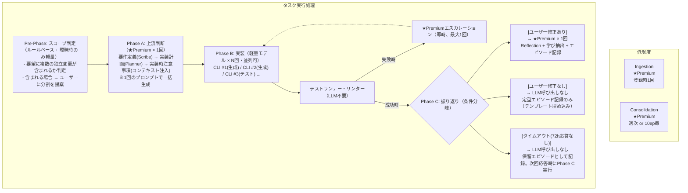
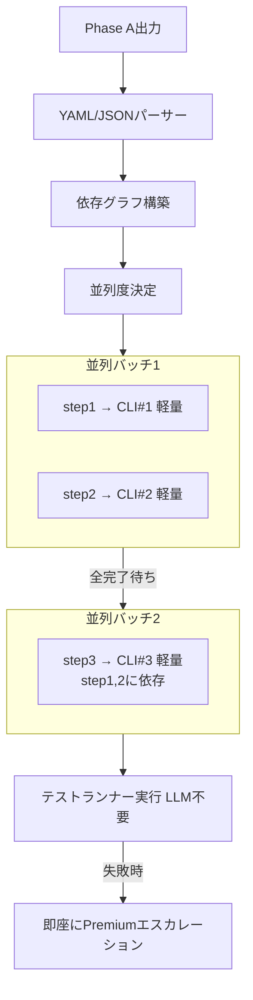
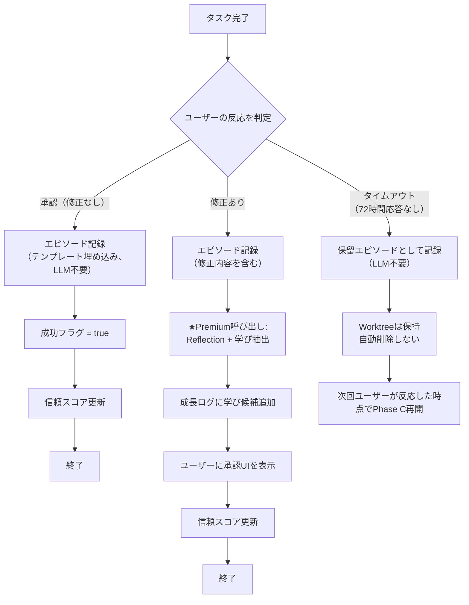
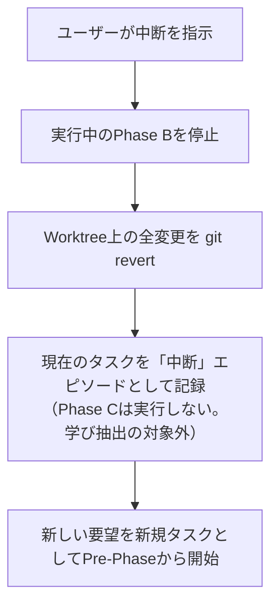

# Deba LLM利用計画書 v2

## 0. 本書の位置づけと前提

### 0.1 ドキュメント間の関係

| ドキュメント | 役割 | 本書との関係 |
|-------------|------|-------------|
| 001_concept.md | システム全体像（Worktree, Brain, プロンプト管理） | Worktreeライフサイクル・ディレクトリ構造の定義元 |
| 002_v2.md | 成長の3メカニズムとGUI/技術スタックの初期検討 | 技術スタック選定の前提 |
| 003_v3_growth_system.md | 3層記憶モデル・学習サイクル・信頼レベル・UI | 記憶モデル・信頼メトリクスの定義元 |
| **004_llm_usage_plan.md** | LLM呼び出し設計（初版） | 本書の前版 |
| **005_llm_usage_plan_v2.md（本書）** | **LLM呼び出し設計（改善版）** | 004の指摘事項を反映し、エラーハンドリング・コスト・用語定義を補完 |
### 0.1.1 本書のスコープと実装フェーズ

本書の各機能は以下のフェーズで実装する。

| フェーズ | 対象セクション | 内容 |
|---------|------------|------|
| **α版（必須）** | §1-7, §8(マトリクス本体), §9.1, §10-11 | コアのPhase A/B/Cフロー、Ingestion、コスト上限、エラーハンドリング基本、テストなし対応 |
| **β版** | §8.4(マスキング), §8.5(オフライン), §9.2, §12 | エラーマスキング、オフライン対応、Consolidation、タスク中断フロー |
| **将来拡張** | §13(優先度低) | Pre-Phase精度改善、マスキング影響分析 |
### 0.2 前提条件

本書は以下を前提とする。前提が満たされない場合、該当セクションの設計は適用できない。

| # | 前提条件 | 根拠 |
|---|---------|------|
| 1 | 対象プロジェクトはGit管理下にある | Ingestionのgit diff、Worktree分離に必須 |
| 2 | 001_concept.mdのWorktree設計が実装済みである | Phase Bの実行環境として依存 |
| 3 | 003_v3の3層記憶モデルが実装済みである | Phase A/Cのコンテキスト注入・学習記録に依存 |
| 4 | LLM APIへのネットワーク接続が利用可能である | オフライン時の挙動は§8.5で定義 |
| 5 | ユーザーはタスク完了後にレスポンス（承認/修正）を返す | タイムアウト時の挙動は§5.1で定義 |

### 0.3 オンボーディングフロー概要

ユーザーがDebaを初めて使用する際の基本フロー。詳細UXは別途UI設計書で定義する。

```
1. プロジェクト登録
   ユーザーがGitリポジトリのパスを指定
   → Worktree作成 → Ingestion実行
   → プロジェクト構造JSONが生成される

2. 初回タスク投入
   ユーザーが自然言語で要望を入力
   → Pre-Phase（スコープ判定）→ Phase A → Phase B
   → 成果物をユーザーに提示

3. フィードバックサイクル開始
   ユーザーが承認 or 修正 → Phase C → 成長サイクルへ
```

---

## 1. 基本方針

| 方針 | 内容 |
|------|------|
| **コア原則** | 判断の質が下流工程に波及する箇所にプレミアムモデルを集中投入する |
| **最適化目標** | データ送信回数（API呼び出し回数）の最小化。処理の複雑さは許容する |
| **プレミアムモデル** | 構造化出力・複数成果物のバンドル生成・文脈横断的な判断が可能なモデル。選定基準は§1.1に定義 |
| **軽量モデル** | 並列CLIツールで使用。定型的なコード生成・修正に限定。選定基準は§1.2に定義 |
| **判断基準** | 試行時間が長くなっても手戻りを防ぐ方が総コストは低い |

### 1.1 プレミアムモデルの選定基準

特定のモデル名には依存しない。以下の性能要件を満たすモデルを選定する。

| 要件 | 基準 |
|------|------|
| 構造化出力の安定性 | JSON Schema指定（Structured Outputs）による安定したパースを担保可能 |
| コンテキスト長 | 入力100Kトークン以上に対応 |
| バンドル出力品質 | 出力前半と後半でセクション品質の劣化が50%以内（評価方法はα版検証で策定） |
| 推論能力 | 複数ファイルにまたがるアーキテクチャ判断が可能 |

### 1.2 軽量モデルの選定基準

| 要件 | 基準 |
|------|------|
| コード生成精度 | 単一ファイル・単一関数スコープの変更で、テスト通過率80%以上 |
| レスポンス速度 | 平均応答時間5秒以内 |
| コスト | プレミアムモデルの1/5以下のトークン単価 |

---

## 2. 用語定義

本書で使用する用語の定義。ドキュメント間の解釈のずれを防ぐ。

| 用語 | 定義 | 粒度 |
|------|------|------|
| **タスク** | ユーザーの1回の要望に対するPhase A〜Cの一連のサイクル。Phase Aで複数ステップに分解されても1タスクとして扱う | ユーザー要望単位 |
| **ステップ** | Phase Aが生成する`implementation_plan.steps`の1要素。1つのCLI実行に対応する | 実装指示単位 |
| **エピソード** | 003_v3で定義。1タスクの完全な記録（入力・出力・修正内容・自己評価） | タスク単位 |
| **スキル** | 003_v3で定義。意味記憶に昇格した、ユーザー承認済みのルール・パターン | 抽象ルール単位 |
| **修正** | ユーザーがDebaの成果物に対して変更を加える行為。severity（minor/major/rejection）で重み付け | — |
| **呼び出し** | LLM APIへの1回のリクエスト-レスポンスサイクル | — |
| **Pre-Phase** | Phase A実行前のスコープ判定ステップ。ユーザー要望に独立した変更が複数含まれる場合に分割を提案する。キーワード検出によるルールベース判定を第一手段とし、判定が曖昧な場合のみ軽量モデルで1回判定 | ユーザー要望単位 |

---

## 3. LLM呼び出しポイント一覧

### 3.1 全呼び出しポイントのマップ



### 3.2 呼び出しポイント詳細

| # | 呼び出しポイント | モデル | 頻度 | 入力データ | 出力データ | 統合先 |
|---|-----------------|--------|------|-----------|-----------|--------|
| 1 | **Ingestion** | Premium | プロジェクト登録時1回 | ソースコード全体 or 要約 | プロジェクト構造・技術・役割の要約JSON | `brain/projects/` |
| 2 | **Phase A: 上流判断** | Premium | タスクごとに1回 | ユーザー要望 + プロジェクト知識 + 意味記憶 + 関連コード | 要件定義書 + 実装計画 + 注意事項（YAML構造化） | worktree `.deba/inbox/` |
| 3 | **Phase B: 実装** | 軽量 | タスクごとにN回（並列） | 実装計画の個別ステップ + 該当ファイル | コード変更 | worktree ソースコード |
| 4 | **Phase B: エスカレーション** | Premium | テスト失敗時（即時） | エラーメッセージ + 該当コード + Phase A計画 | 修正コード or 計画修正提案 | worktree ソースコード |
| 5 | **Phase C: Reflection** | Premium | 修正ありタスクのみ | エピソード全体 + ユーザー修正内容 + 既存スキル | 自己評価 + 学び候補 + 成長ログエントリ | `brain/growth_log/`, `brain/episodes/` |
| 6 | **Consolidation** | Premium | 週次 or 10エピソード蓄積時 | 未分析エピソード群 + 既存スキル | 新規パターン + 学び候補 | `brain/growth_log/` |

---

## 4. プレミアムモデル使用回数の見積もり

### 4.1 タスクあたりのプレミアムモデル使用回数

| シナリオ | Phase A | Phase B エスカレーション | Phase C | 合計 |
|---------|---------|----------------------|---------|------|
| 修正なし（成功タスク） | 1回 | 0回 | 0回 | **1回** |
| 修正あり（学習タスク） | 1回 | 0回 | 1回 | **2回** |
| 実装困難タスク | 1回 | 1回 | 1回 | **3回** |
| 大規模タスク（Phase A分割） | 2回 | 0〜1回 | 0〜1回 | **2〜4回** |

### 4.2 月間見積もり（感度分析）

「1日5タスク × 20営業日 = 月間100タスク」を基本条件とし、修正率を3パターンで試算する。

| 項目 | 修正率50%（初期） | 修正率30%（安定期） | 修正率10%（成熟期） |
|------|------------------|-------------------|-------------------|
| 修正なしタスク | 50 × 1回 = 50 | 70 × 1回 = 70 | 90 × 1回 = 90 |
| 修正ありタスク | 50 × 2回 = 100 | 30 × 2回 = 60 | 10 × 2回 = 20 |
| エスカレーション（想定15%） | 8 × 1回 = 8 | 5 × 1回 = 5 | 2 × 1回 = 2 |
| Consolidation | 10回 | 10回 | 10回 |
| Ingestion | 2回 | 2回 | 2回 |
| **Premium合計** | **170回** | **147回** | **124回** |
| 軽量モデル合計 | 綄100回 | 約100回 | 約100回 |

> **修正率の根拠**: 修正率50%は、003_v3§3.1の信頼レベルLv1（見習い）における想定値。30%はLv1→Lv2への移行期、10%はLv2（一人前）到達後の目標値。α版運用で実測し補正する。

> **トークン消費量の精緻化プロセス**: 上記は概算レンジである。α版の最初の20タスクで入出力トークン数を実測し、以下を更新する: (1) Phase A/B/Cの平均トークン消費量、(2) コスト概算の精緻化、(3) 月間上限値の適正化。

### 4.3 月間コスト概算

モデル名を特定せず、トークン単価レンジで概算する。

| モデル種別 | 想定入力トークン/回 | 想定出力トークン/回 | 単価レンジ（入力/出力） | 月間回数（安定期） | 月額概算 |
|-----------|-------------------|-------------------|----------------------|------------------|---------|
| Premium | 30K〜80K | 2K〜5K | $3〜15 / $10〜60 per 1Mトークン | 145回 | **$20〜$90** |
| 軽量 | 5K〜15K | 1K〜3K | $0.1〜1 / $0.3〜3 per 1Mトークン | 300回 | **$1〜$10** |
| **合計** | — | — | — | — | **$21〜$100** |

> **注**: 上記は2026年2月時点のAPI価格帯に基づく概算。モデル選定後に実測ベースの精緻な見積もりを行う。

### 4.4 成長に伴う使用量推移

信頼レベルが上がり修正率が下がるにつれ、Phase Cの発動頻度が自然に減少する:

| 信頼レベル | 想定修正率 | タスクあたりPremium平均 | 月間Premium概算 |
|-----------|-----------|----------------------|----------------|
| Lv1 見習い | ~50% | 1.7回 | 170回 |
| Lv2 一人前 | ~20% | 1.3回 | 142回 |
| Lv3 信頼 | ~10% | 1.1回 | 124回 |

### 4.5 コスト上限安全弁

意図せぬ呼び出し増大（修正ループ暴走等）を防ぐため、以下の上限を設定する。

| スコープ | デフォルト上限 | 超過時の挙動 |
|---------|-------------|-------------|
| タスク単位 | Premium 4回、軽量 20回 | タスクを一時停止し、ユーザーに続行/中止を確認 |
| 日次 | Premium 30回 | 新規タスクの受付を停止し、ユーザーに通知 |
| 月次 | Premium 500回 | 警告表示（Phase別呼び出し回数サマリーを提示）。ユーザーが明示的に上限を引き上げない限り新規タスクを受け付けない |

上限値はユーザーが `settings.json` で変更可能とする。

---

## 5. Phase A プロンプト設計指針

> **設計原則**: Phase Aは全体品質の起点である。ここでの判断品質がPhase B以降の成果物品質を決定するため、プレミアムモデルを集中投入し、バリデーションとフォールバックで品質を担保する。

### 5.1 バンドル出力戦略

1回のプロンプトで以下の3成果物を同時に生成する。出力は堅牢なJSON形式（JSON SchemaによるStructured Outputs）で構造化し、パースエラーを根本から排除する。

```json
// Phase A 出力フォーマット（JSON Schemaによる型保証）

{
  "requirements": {
    "goal": "（目的の1文要約）",
    "specs": [
      {
        "item": "（仕様項目1）",
        "reasoning": "（なぜこの仕様か）"
      }
    ],
    "acceptance_criteria": [
      "（完了条件1）"
    ]
  },
  "implementation_plan": {
    "steps": [
      {
        "id": 1,
        "description": "（ステップ内容）",
        "target_files": ["path/to/file.ts"],
        "parallelizable": true,
        "dependencies": []
      },
      {
        "id": 2,
        "description": "（統合テスト）",
        "target_files": [],
        "parallelizable": false,
        "dependencies": [1]
      }
    ]
  },
  "cautions": [
    {
      "context": "（関連する意味記憶や過去の学び）",
      "instruction": "（この実装で注意すべき具体的な点）"
    }
  ]
}
```

### 5.2 出力バリデーション

Phase A出力に対し、以下の論理的バリデーションを自動実行する。フォーマット自体はStructured Outputsにより保証される前提とする。バリデーション失敗時はフォールバック（§5.4）を発動する。

| バリデーション項目 | チェック内容 | 失敗時の対応 |
|------------------|------------|-------------|
| 依存ファイルの直列化 | インターフェースと呼び出し側の同時変更など、相互依存するファイル間での並列実行（競合）が発生しないようにステップが分割・直列化されていること | 再計画（フォールバック） |
| ステップ完全性 | steps数 ≥ 1、各stepにtarget_filesが存在 | フォールバック |
| 注意事項存在 | cautionsセクションが空でないこと | 警告ログのみ（続行可） |
| 依存グラフ整合性 | dependenciesに存在しないstep IDが参照されていないこと、および循環依存が存在しないこと | フォールバック |

### 5.3 コンテキスト注入の優先順位

Phase Aのプロンプトに含めるコンテキストの優先順位（トークン上限に対する配分）:

| 優先度 | コンテキスト | トークン配分目安 | 理由 |
|--------|-------------|-----------------|------|
| 1（必須） | ユーザーの要望 | 5% | 起点。正確に伝達 |
| 2（必須） | 意味記憶（承認済みスキル） | 10% | 過去の学びを反映 |
| 3（必須） | 対象ファイルのソースコード | 40% | 実装判断の根拠 |
| 4（重要） | プロジェクト構造要約（Ingestion結果） | 15% | 全体の文脈理解 |
| 5（推奨） | 関連エピソード（直近の類似タスク） | 10% | 同種の失敗の回避 |
| 6（任意） | 依存先のインターフェース定義 | 20% | 整合性の確保 |

### 5.4 フォールバック条件

以下の場合、Phase Aを「要件定義」と「実装計画」の2回に分割する:

| 条件 | トリガー |
|------|---------|
| 出力バリデーション失敗 | §5.2のバリデーション＋修復プロンプトが失敗 |
| 大規模スコープ | 対象ファイルが10以上にまたがるタスク |
| 複数独立変更 | ユーザーの要望が2つ以上の独立した変更を含む |

分割時のプレミアムモデル使用回数: 2回（Phase A1 + Phase A2）、最大4回（+ エスカレーション + Phase C）

### 5.5 出力形式の確定（JSON: Structured Outputs）

YAMLのインデントエラー等のフォーマット破壊を防ぎ、堅牢なパースを実現するため、**JSON（Structured Outputs機能によるSchema保証）**を標準採用する。人間への可読性はCLIツール（Deba）側でパース後に再フォーマットして提示することで担保する。

---

## 6. Phase B 並列実行設計

### 6.1 CLIツール分配ルール

Phase Aの `implementation_plan.steps` を解析し、`parallelizable: true` かつ `dependencies` が解決済みのステップを並列にCLIツールへ分配する。



### 6.2 並列度制御ポリシー

| 制約 | ルール |
|------|-------|
| 最大同時CLI数 | 5（マシンリソースとAPIレート制限に基づく。設定で変更可） |
| ファイルレベル排他制御 | 同一ファイルを`target_files`に含むステップは同一バッチに入れない（直列化） |
| 依存関係の確実な直列化 | インターフェースの変更とその利用側の変更など、相互に依存するファイルは必ず直列バッチに分けるか同一ステップにまとめる（Phase Aで保証） |
| APIレート制限対応 | 429レスポンス受信時、指数バックオフ（初回1秒、最大30秒、最大5回リトライ） |
| Worktreeの独立・隔離 | 並列実行中の`git revert`による未追跡ファイルの残骸やコンフリクト（デッドロック）を防ぐため、バッチ実行時は**実装用の一時的なGit branch（または独立Worktree）**を作成し、静的解析・テストが通った場合のみメインのWorktreeへマージ（Apply）する |

### 6.3 軽量モデルへのプロンプト設計

軽量モデルにはアーキテクチャ判断を委ねない。Phase Aが生成した実装計画をそのまま実行する「指示遂行型」のプロンプトとする。

```markdown
# 指示
以下の実装ステップを正確に実行してください。設計判断は不要です。

## 実装ステップ
{{STEP_DESCRIPTION}}

## 対象ファイル
{{TARGET_FILE_CONTENT}}

## 注意事項
{{CAUTIONS_FROM_PHASE_A}}

## 曖昧性が生じた場合
実装の詳細が不明な場合は、変更を行わずに以下の形式で報告してください:
AMBIGUITY: （何が不明か）

## 出力形式（精密な差分適用）
コンテキスト長あふれやLLMの置換ミスを防ぐため、対象ファイルの全量出力は行わない。
AST（抽象構文木）ベースの置換、あるいは精密な行番号付きのDiffブロック（Search & Replace形式）を用いて**変更箇所のみ**を出力してください。

例:
<<<<
（変更前の正確なコード数行）
====
（変更後のコード）
>>>>
```

### 6.4 エスカレーションフロー

テストフローを「構文/Lintチェック」と「ロジック（テスト）チェック」の2段階に分離し、エラー種別に応じてエスカレーションの有無を切り替える。これにより、安易なエスカレーションによるコスト高騰を防ぐ。

| 項目 | 内容 |
|------|------|
| **構文/Lintエラー時** | 些細なTypoやimport忘れと見なし、**軽量モデル自身にエラー文をフィードバックして自己修復させる**（最大3回までリトライ）。3回失敗でエスカレーション。 |
| **テスト失敗時** | 構造的な理解不足や設計ミスと見なし、**即座にPremiumモデルにエスカレーションする**。 |
| 入力 | エラーメッセージ + 該当コード + Phase Aの元計画 |
| 期待出力 | 修正コード、**または**「Phase Aの計画自体に問題がある」という計画修正提案 |
| 上限 | タスクあたりエスカレーション1回まで。それでも失敗ならユーザーに手動対応を依頼 |

---

## 7. Phase C 条件分岐設計

### 7.1 判定ロジック



### 7.2 Phase C バンドル出力

修正ありの場合、1回の呼び出しで以下を同時生成:

```yaml
# Phase C 出力フォーマット

reflection:
  what_happened: "（何が起きたか）"
  why_corrected: "（なぜユーザーが修正したか）"
  self_assessment: "（自己評価）"

learnings:
  - summary: "（学びの1文要約）"
    generalizability: "high | medium | project_specific"
    related_skills: "new | reinforce | modify:skill_name"
    proposed_rule: "（意味記憶に昇格する場合のルール文）"

episode_metadata:
  task_type: "（タスク種別）"
  complexity: 1-3
  success: false
  correction_severity: "minor | major | rejection"
```

### 7.3 「修正なし＝学びなし」仮定の検証

この仮定には以下のリスクがある。継続的に検証する。

| リスク | 内容 | 対策 |
|-------|------|------|
| 見逃し承認 | ユーザーが詳細を確認せず承認する場合がある | 遡及修正フローで後から修正可能にする（下記参照） |
| 遅延発覚バグ | 承認後にバグが発覚する場合がある | 遡及修正フロー（バグ報告）→ Phase C遅延実行 |
| 仕様変更 | 承認時は正しかったが、後から仕様が変わった | 遡及修正フロー（仕様変更）→ 新タスクとして処理 |
| 改善機会の損失（学習汚染） | 動くが最適ではないコード（技術的負債）をユーザーが承認してしまい、それが正解としてRAG文脈に混入しスパゲッティ化を招く | Consolidation（§9.2）において、**ユーザー修正のない成功エピソードに対してもPremiumモデルによる静的解析・コード品質評価**を実施し、規約違反や潜在的負債を摘出して自己改善タスクを生成する。 |

**遡及修正フロー**: ユーザーが過去に承認したタスクについて後から問題を報告する際に、以下の種別を入力時に指定する。

| 種別 | 説明 | Phase Cの扱い |
|------|------|-------------|
| **bug** | Debaの成果物にバグがあった。当時の仕様に対して誤り | エピソードを「成功→修正あり」に変更し、Phase Cを遅延実行。**学び抽出の対象**（Debaのミスとして信頼スコアに反映） |
| **spec_change** | 仕様自体が変わった。当時の成果物は正しかった | 新規タスクとしてPre-Phaseから開始。元エピソードは「成功」のまま維持。**学び抽出の対象外**（Debaのミスではない） |

バグ報告による遡及修正で生成されたPhase C出力は、**次回のConsolidationサイクルの対象に含める**。

---

## 8. エラーハンドリングマトリクス

各呼び出しポイントごとの失敗ケースとリカバリーフロー。

| Phase | 失敗ケース | リカバリー | 最大リトライ | 最終手段 |
|-------|----------|-----------|------------|---------|
| **Ingestion** | APIエラー | 指数バックオフリトライ | 3回 | ユーザーに再実行を促す |
| **Ingestion** | コンテキスト超過 | 要約モードに切り替え（ファイルツリー + 主要ファイル抜粋） | 1回 | 手動でファイル選択を依頼 |
| **Phase A** | APIエラー | 指数バックオフリトライ | 3回 | ユーザーに再試行を提案 |
| **Phase A** | YAMLパース失敗 | 修復プロンプト送信 | 1回 | フォールバック（A分割）。それでも失敗ならJSON形式で再試行 |
| **Phase A** | 出力バリデーション失敗 | フォールバック（A分割） | 1回 | ユーザーに要望の詳細化を依頼 |
| **Phase B** | 構文 / Lintエラー | 軽量モデル自身による自己修復リトライ | 3回 | Premiumエスカレーション |
| **Phase B** | テスト（ロジック）失敗 | 即座にPremiumエスカレーション | — | ユーザーに手動対応を依頼（該当ステップをスキップ） |
| **Phase B** | AMBIGUITY報告 | Phase Aのcautionsを補完してリトライ | 1回 | ユーザーに判断を求める |
| **Phase B** | ファイル競合 | バッチをgit revert → 直列実行に切り替え | 1回 | ユーザーに報告 |
| **Phase C** | APIエラー | 指数バックオフリトライ | 3回 | エピソードを「Reflection未完了」として記録。次回Consolidation時に再処理 |
| **Consolidation** | APIエラー | 次回トリガー時に再実行 | — | 手動トリガーを提供 |
| **全Phase共通** | レート制限(429) | 指数バックオフ（1s→2s→4s→8s→16s） | 5回 | 15分間の処理一時停止→再試行 |
| **全Phase共通** | ネットワーク断 | ローカルキューに保存。接続回復後にバッチ送信 | — | オフラインモード表示 |
| **全Phase共通** | エラーメッセージ内の機密情報 | デフォルトマスキング自動適用（下記参照） | — | — |

### 8.4 エラーメッセージのマスキング

LLMに送信するエラーメッセージには機密情報が含まれる可能性がある。以下のデフォルトマスキングを自動適用する。

| マスキング対象 | パターン | 置換後 |
|-------------|---------|-------|
| 環境変数値 | `$ENV_VAR` の展開値 | `[ENV:VAR_NAME]` |
| 絶対パス | `/Users/*`, `/home/*`, `C:\*` | 相対パスに変換 |
| APIキー/トークン | Regexベースのシークレットスキャン（AWS/GCPキー、JWT、`password=`等） | `[REDACTED]` |
| IPアドレス | IPv4/IPv6パターン | `[IP_ADDR]` |

**注意**: 「連続20文字以上の英数字列」といった単純な長さ制限によるマスキングは廃止する。GitのコミットハッシュやBase64化されたテスト用ダミーデータなどが巻き込まれ、デバッグ文脈（「ハッシュが不一致です」等のエラー）が破壊されるのを防ぐためである。

### 8.6 呼び出しログの標準フィールド

全てのLLM呼び出しで以下のフィールドをログに記録する。α版ではファイルベースの簡易ログで実装し、将来的に可視化ダッシュボード（003_v3 §4.2の成長レポート）に統合する。

| フィールド | 型 | 説明 |
|---------|------|------|
| `timestamp` | ISO 8601 | 呼び出し開始時刻 |
| `task_id` | string | タスクID |
| `phase` | enum | `ingestion` / `phase_a` / `phase_b` / `phase_b_fix` / `phase_b_escalation` / `phase_c` / `consolidation` |
| `step_id` | int? | Phase Bのみ。実行中のステップID |
| `model_tier` | enum | `premium` / `lightweight` |
| `input_tokens` | int? | 取得可能な場合（best effort） |
| `output_tokens` | int? | 取得可能な場合（best effort） |
| `latency_ms` | int | リクエストからレスポンス完了までの時間 |
| `status` | enum | `success` / `error` / `timeout` / `validation_failed` |
| `error_type` | string? | 失敗時のエラー種別 |

### 8.5 オフライン時の挙動

| 状態 | 挙動 |
|------|------|
| タスク実行中にネットワーク断 | 実行中のPhaseの結果を破棄し、タスクをキューに保存。接続回復後に再開 |
| オフライン中の新規タスク依頼 | ユーザー要望をローカルキューに保存。LLM呼び出しは接続回復後に実行 |
| Consolidationトリガー発火 | 次回オンライン時に実行をスケジュール |

---

## 9. 低頻度処理

### 9.1 Ingestion

| 項目 | 内容 |
|------|------|
| トリガー | プロジェクト新規登録時、またはユーザーが明示的に再実行 |
| モデル | Premium |
| 入力 | ソースコード全体（推定トークン数が100K以下の場合）or **ASTパースによる関数/クラスのシグネチャ抽出 + ファイルツリー**（100K超過時。実装の詳細を削り、インターフェース定義のみを保持して文脈を圧縮する） |
| 出力 | プロジェクト構造JSON（`brain/projects/{hash}.json`） |
| 差分更新条件 | `git diff` で変更ファイル率がリポジトリ全体の30%未満の場合、差分のみ送信して既存JSONを更新 |
| フルIngestion再実行条件 | 変更ファイル率30%以上、または前回Ingestionから30日以上経過 |

### 9.2 Consolidation

| 項目 | 内容 |
|------|------|
| トリガー | 同一プロジェクトで10エピソード蓄積 or 週次 |
| 対象 | Phase C実行済みエピソード（修正あり）＋ 成功エピソード（修正なし）の両方 |
| モデル | Premium |
| 入力 | 未分析エピソード群の要約 + 既存意味記憶 |
| 出力 | 新規パターン候補 + 既存スキルの修正提案 |
| 最適化 | エピソードを要約してからバッチ送信（生データ全量は送らない） |

---

## 10. 呼び出し回数まとめ

### タスク1回あたり

| ケース | Premium | 軽量 | LLM不要の処理 |
|--------|---------|------|--------------|
| 修正なし | **1回** (Phase A) | 1回 (Phase B) | エピソード記録、テスト実行 |
| 修正あり | **2回** (Phase A + C) | 1回 (Phase B) | テスト実行 |
| 実装困難 | **3回** (Phase A + B escalation + C) | 1回 (Phase B) | テスト実行 |
| 大規模タスク（フォールバック） | **2〜4回** (Phase A分割 + escalation + C) | N回 (Phase B) | テスト実行 |

### 定期処理

| 処理 | Premium | 頻度 |
|------|---------|------|
| Ingestion | 1回 | プロジェクト登録時（差分更新 or フル再実行） |
| Consolidation | 1回 | 週次 or 10エピソードごと |

---

## 11. テストのないプロジェクトへの対応

Phase Bの品質保証はテストランナー依存であるため、テストが存在しないプロジェクトへの対策を定義する。

| 状況 | 対応 |
|------|------|
| テストフレームワーク未導入 | Phase Aのステップに「テスト追加」を自動付与する or ユーザーにテスト導入を推奨 |
| テストあるが対象ファイルにテストなし | Phase Bの並列ステップに「対象ファイルのユニットテスト生成」を追加。生成されたテストは**ユーザーがレビューしてから**品質保証の基準として使用する |
| ユーザーがテスト不要と明示 | リンター実行のみで品質保証。修正ループの判定はリンターエラーに限定 |

---

## 12. タスク途中の要件変更フロー

Phase B実行中にユーザーが要件変更を希望した場合のフロー。



中断されたタスクのWorktreeは7日後に自動クリーンアップを提案（ユーザー確認あり）。

---

## 13. 今後の検証項目

### 優先度高（α版開始前に完了）

- [x] Phase A統合プロンプトのドラフト作成と、出力後半品質の検証テスト → `docs/drafts/phase_a_prompt_draft.md`
- [x] YAML vs JSON出力形式の安定性比較テスト（パース成功率の計測） → `docs/drafts/yaml_vs_json_test_plan.md`
- [x] 軽量モデルの選定と、Phase Bにおけるコード生成品質の評価 → `docs/drafts/lightweight_model_evaluation_plan.md`

### 優先度中（α版運用中に検証）

- [ ] フォールバック判定の閾値チューニング（対象ファイル数、スコープの広さ）
- [ ] 「修正なし＝学びなし」仮定の妥当性を、運用データで継続検証
- [ ] 差分Ingestionの実装可否と精度検証
- [ ] 並列度上限とAPIレート制限の最適値チューニング
- [ ] エスカレーション発生率の実測とコスト影響の評価

### 優先度低（β版以降）

- [ ] Pre-Phaseのルールベース判定の精度改善
- [ ] オフラインキューイングの実装方式の検証
- [ ] マスキングによる修正精度への影響分析
